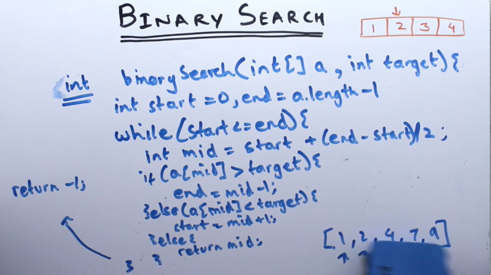

**BINARY SEARCH**

- only applicable to sorted array
- o(logn)
- Find a mid, use mid = start + (end - start)/2 because if you use mid = start + end/2 there is a bug. If number is greater than 2billion than it goes in negative to wrap around

