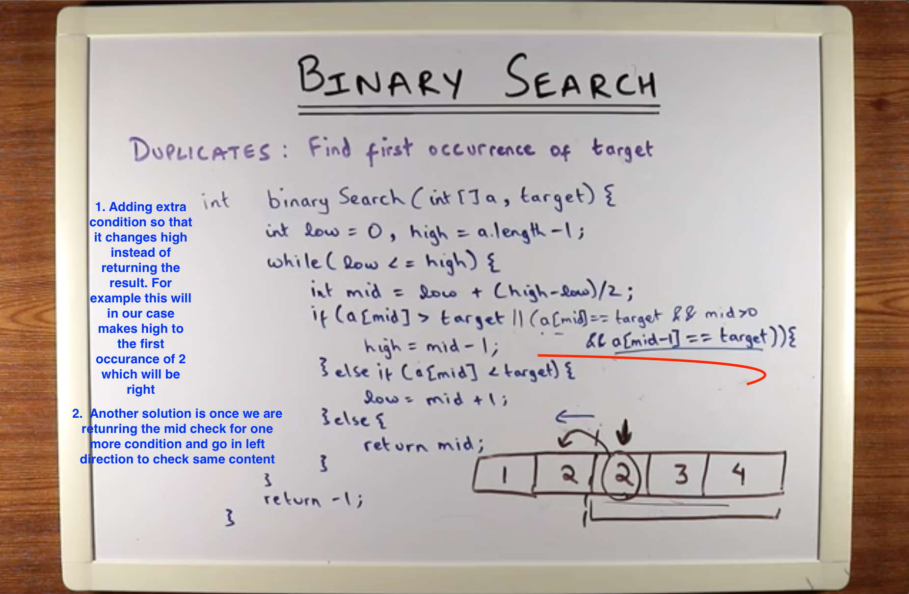
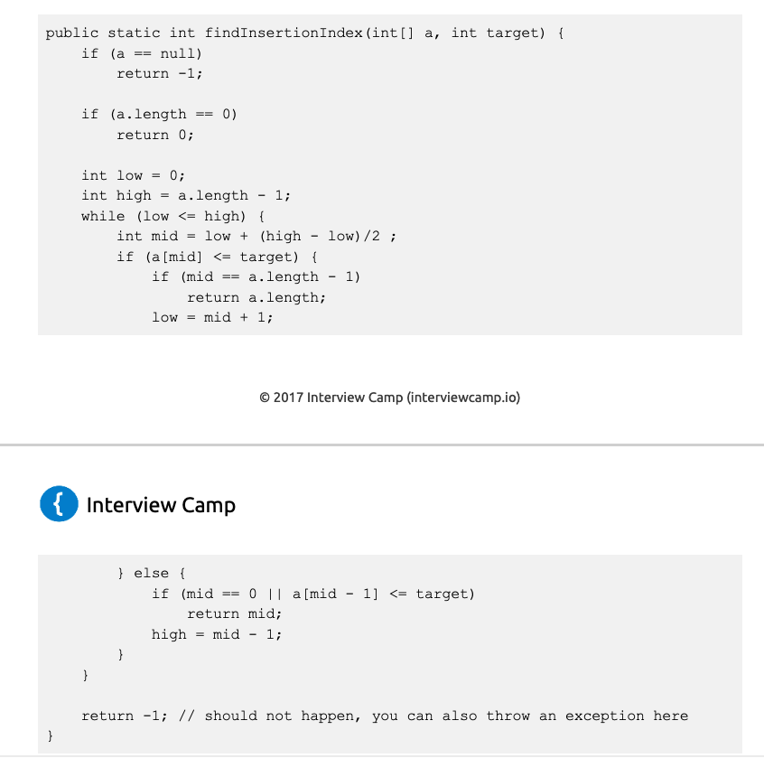
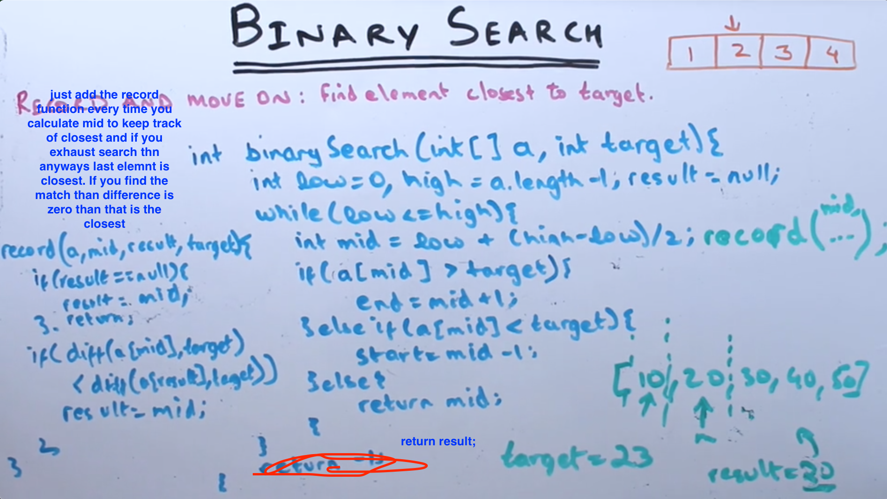
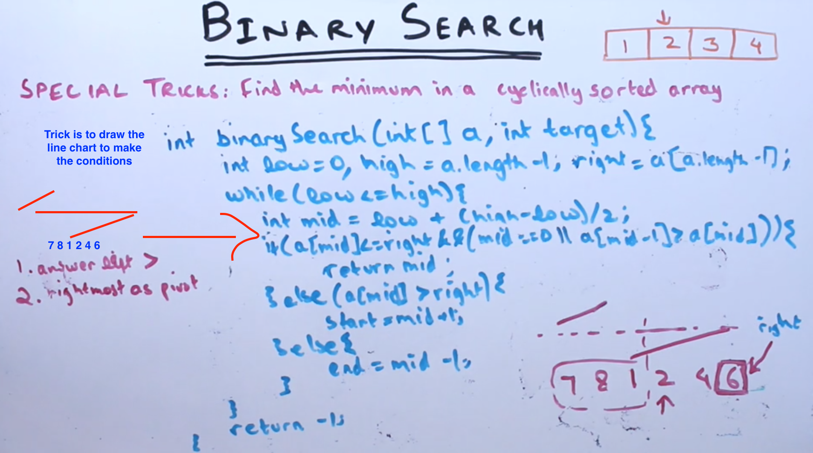
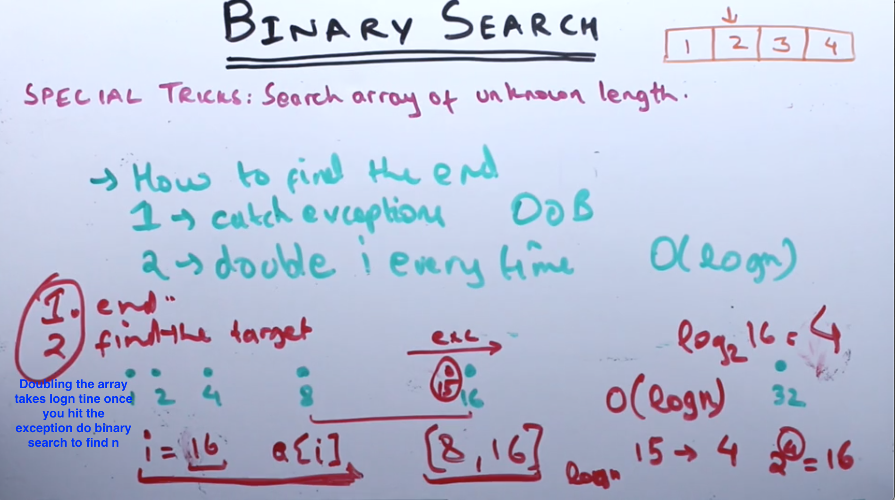
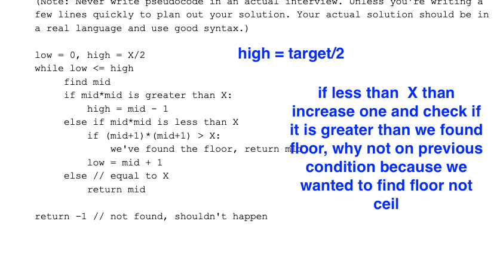
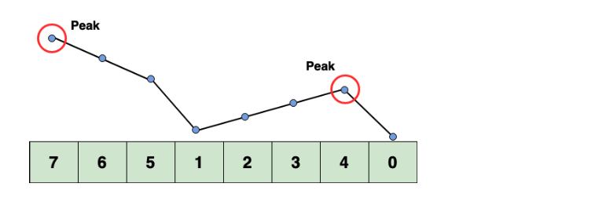
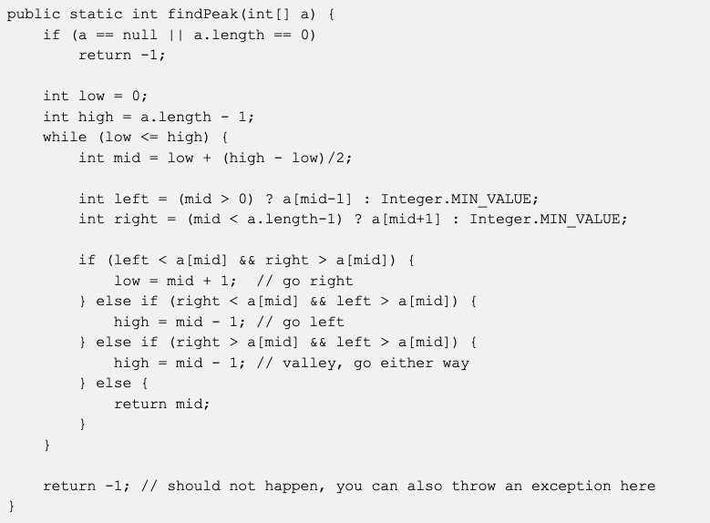

**BINARY SEARCH**

- only applicable to sorted array
- o(logn)
- Find a mid, use mid = start + (end - start)/2 because if you use mid = start + end/2 there is a bug. This prevents overflow in large numbers
- O(log N) basically means time goes up linearly while the n goes up exponentially. So if it takes 1 second to compute 10 elements, it will take 2 seconds to compute 100 elements, 3 seconds to compute 1000 elements, and so on.
- don't jump into implementation, start writing the conditions by taking example and sudo code

----

-----

- Given an array A and target T, Find the first element larger than T

**BINARY SEARCH RECORD AND MOVE**

- Given a sorted array A and a target T, find the target. If the target is not in the array, find the number closest to the target. For example, if A = [2,3,5,8,9,11] and T = 7, return 8.

----

----
Search Array of Unknown length

------------------------
Find the square root of an integer X. For example, squareRoot(4) = 2.

-----
search a peak

