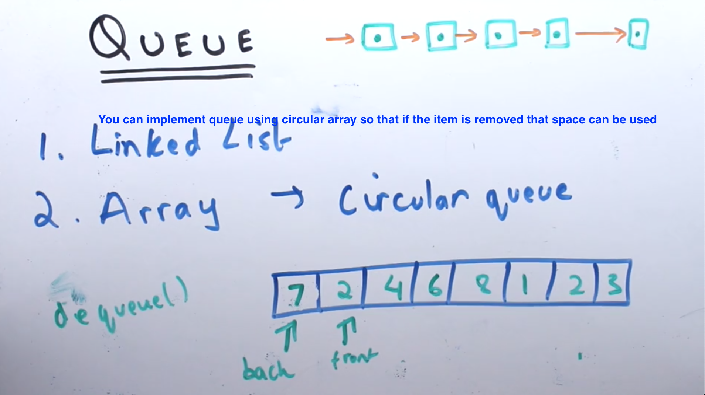
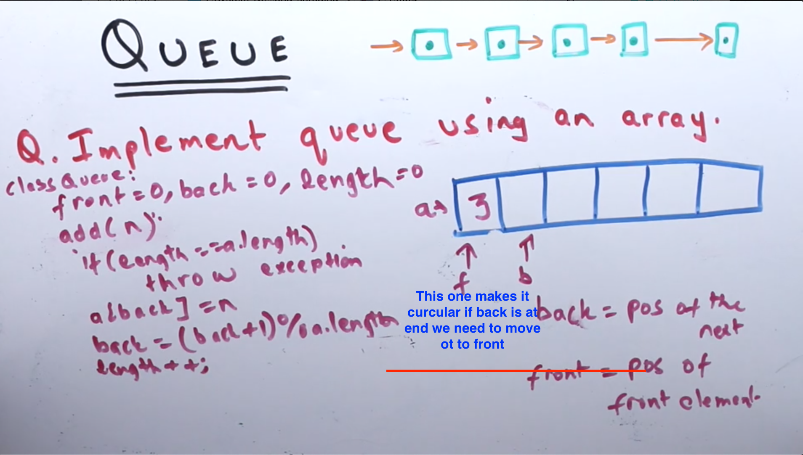
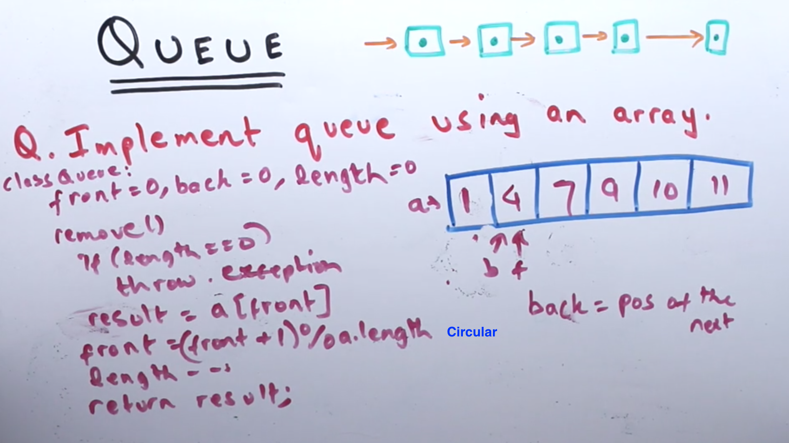
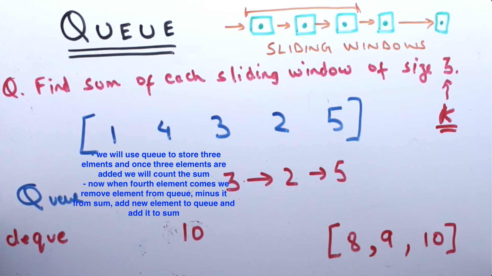
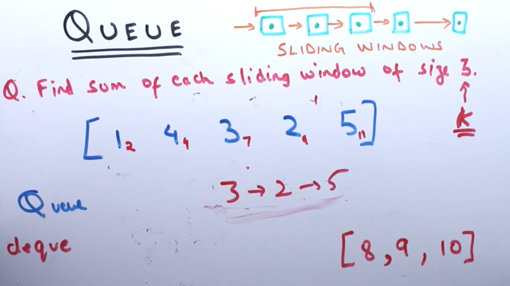

**QUEUE**

- Queue can be implemented using Linked list and circular array
- Circualr array so that if the item is removed from the front it can be used to add another item

- back = (back + 1) % a.length (circles the queue around to starting position)

--------
----------------------------------------------------------------

**QUEUE SLIDING WINDOW**

- whenever you have sliding window problems, queue's are great to solve the problems
- let's find um of each sliding window of size 3
  - Sliding Windows: Given an array of integers A, find the sum of sliding windows of size N. For example: if A = [2,3,5,6,2,1]
  - Instead of an array, what if you were presented with a stream of numbers. A new number can be added anytime. You want to find the sum of the last K elements.
  - we will use queue to store three elments and once three elements are added we will count the sum 
  - now when fourth element comes we remove element from queue, minus it from sum, add new element to queue and add it to sum

  

- Max Srock price within certain days, can be solved using sliding window with queue. So you will have sliding window of queue which keeps the value of stacks in 4 days

  

  