**Syatem Design High level**

- ask for what features the system can have
- scalable web application, start with single server system
- Add load balancers, multiple web app servers, multiple cache, multiple DB, task queue for quick response, Data peocessing in DB layer

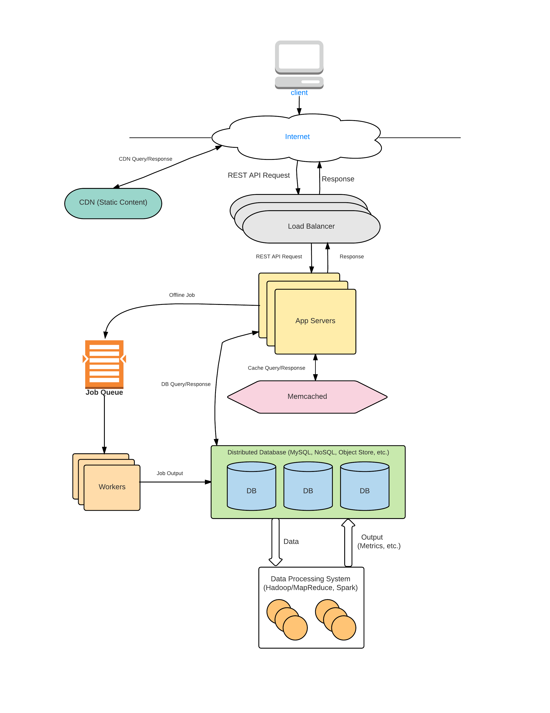
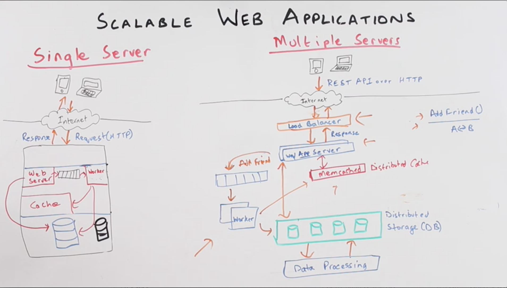

-----
-----

**Approaching System design interview questions**

- (F) Define two or three core features for the system
- (U) UseCases - what are the different API's needed to achieve some features
- (S) Store  -  what to store, not the DB models. For example. customer profile, driver profile, customer state, driver state
- (H) High level design
- (D) Detailed level design

----

**System Design High Level UBER/LYFT**

- (F)
1. Users and Drivers
2. Hail ride (find and complete)

- (U)
1. Rider - Request a ride,  Get ETA,  Ride to Destinition, END ride
2. Driver - Accept/reject, Pickup Passender, Drive, End ride
3. Create workflow for the features

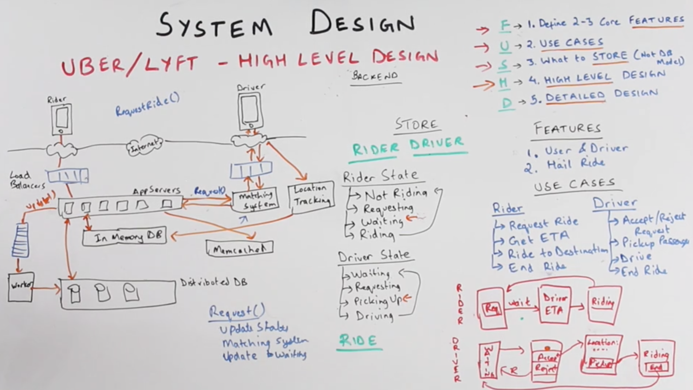
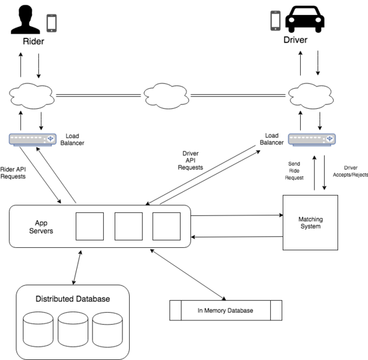

------
------

**LOAD BALANCER**

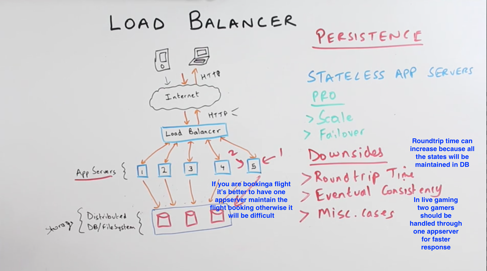

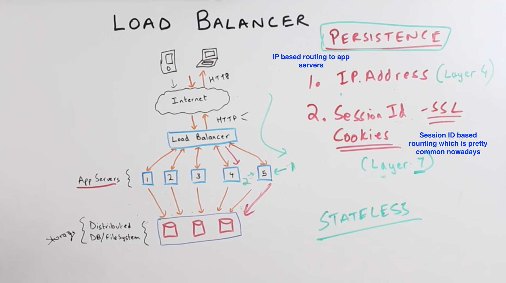

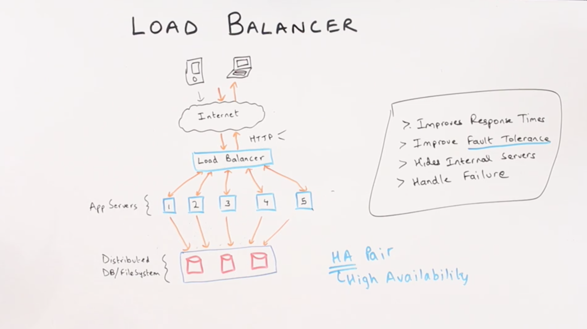

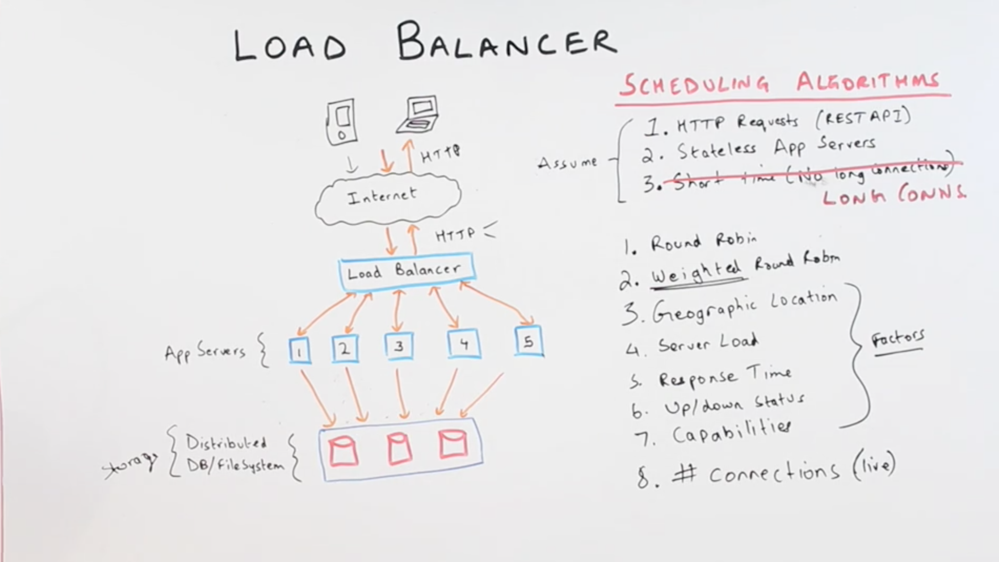

------
------

**SHRADING**

- it's splitting db in small pieces and find some way (logic) to make it work togather - find what piece is where
- What can be shradded? 
1. Distributed Database
2. Distributed Cache - Memcached is a high-performance, distributed caching system. Although application-neutral, it's most commonly used to speed up dynamic Web applications by alleviating database load
[Memchche article](linuxjournal.com/article/7451)
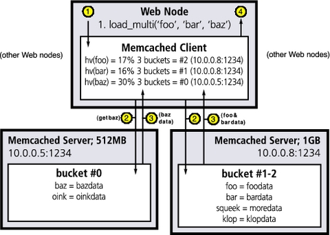
3. Distributed Hash Table
4. Distributed Key-Value Stores

**CAP THEOREM**

*ACID*
- ACID DBs are Consistent and Base DBs are Eventually Consistent
- Atomic - Everything in the write/update succeeds or the entire operation is rolled back
- Consistent - The database will never be in a state where two reads to the same DB get different value.
- Isolated - Operations cannot interfere with each other.
- Durable - Completed operations are persisted, even if the machine restarts, etc.

*BASE*
- Basic Availability
- Soft State
- Eventual Consistency
- With BASE, instead of requiring consistency in each transaction, it is ok to return different values until the update is eventually applied. The system will prioritize Availability over Consistency.

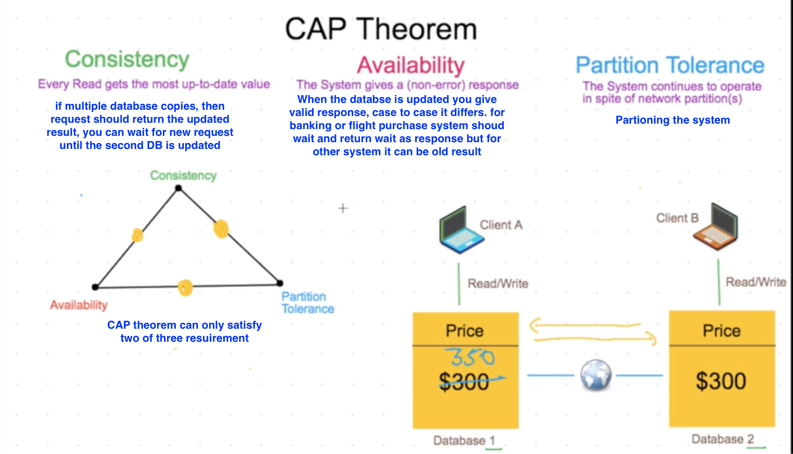

- Where is it ok to have Eventual Consistency? : Let’s say you are storing blog posts. it's okay to show old post until updated.

- Where would you want Consistency? Let’s say you are storing user passwords. Old password should not work anywhere. 

**SHRADING PARTITION FUNCTION**

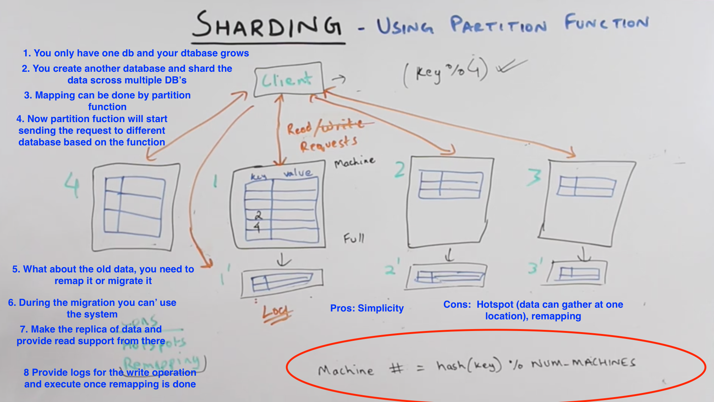

