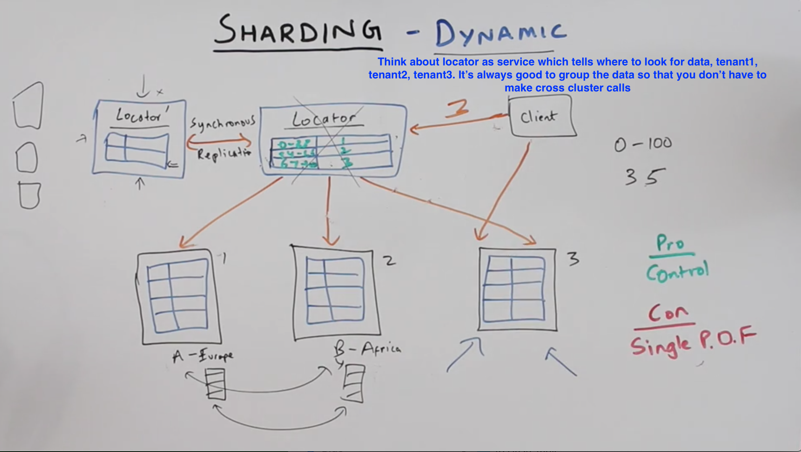
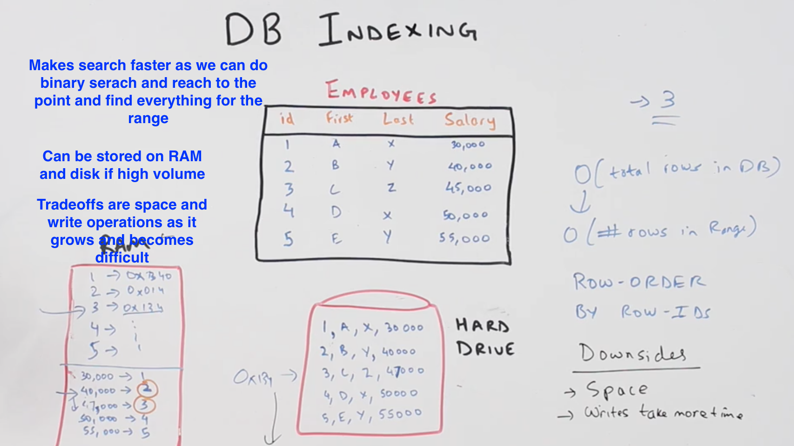

**Syatem Design High level**

- ask for what features the system can have
- scalable web application, start with single server system
- Add load balancers, multiple web app servers, multiple cache, multiple DB, task queue for quick response, Data peocessing in DB layer

-----
-----

**Approaching System design interview questions**

- (F) Define two or three core features for the system
- (U) UseCases - what are the different API's needed to achieve some features
- (S) Store  -  what to store, not the DB models. For example. customer profile, driver profile, customer state, driver state
- (H) High level design
- (D) Detailed level design

----

**System Design High Level UBER/LYFT**

- (F)
1. Users and Drivers
2. Hail ride (find and complete)

- (U)
1. Rider - Request a ride,  Get ETA,  Ride to Destinition, END ride
2. Driver - Accept/reject, Pickup Passender, Drive, End ride
3. Create workflow for the features

------
------

**LOAD BALANCER**

------
------

**SHRADING**

- it's splitting db in small pieces and find some way (logic) to make it work togather - find what piece is where
- What can be shradded? 
1. Distributed Database
2. Distributed Cache - Memcached is a high-performance, distributed caching system. Although application-neutral, it's most commonly used to speed up dynamic Web applications by alleviating database load
[Memchche article](linuxjournal.com/article/7451)

3. Distributed Hash Table
4. Distributed Key-Value Stores

**CAP THEOREM**

*ACID*
- ACID DBs are Consistent and Base DBs are Eventually Consistent
- Atomic - Everything in the write/update succeeds or the entire operation is rolled back
- Consistent - The database will never be in a state where two reads to the same DB get different value.
- Isolated - Operations cannot interfere with each other.
- Durable - Completed operations are persisted, even if the machine restarts, etc.

*BASE*
- Basic Availability
- Soft State
- Eventual Consistency
- With BASE, instead of requiring consistency in each transaction, it is ok to return different values until the update is eventually applied. The system will prioritize Availability over Consistency.

- Where is it ok to have Eventual Consistency? : Let’s say you are storing blog posts. it's okay to show old post until updated.

- Where would you want Consistency? Let’s say you are storing user passwords. Old password should not work anywhere. 

**SHRADING PARTITION FUNCTION**

**DYNAMIC SHRADDING**

**SHARADING CONSISTENET HASHING**

- With Consistent Hashing, you can minimize the movement of data when adding a new node in a distributed database.

----------------------------------------------------------------
----------------------------------------------------------------

**INDEXING**

**NOSQL DB**

- start of with no-sql db if you want scalable website
- traditional SQL is relational (structured), good for data anlysis 
- it's hard to scale horizontally
- when your data is growing, using sharding to 100 of db's will be difficult
- Nosql db can scale horizontally 
- key-value store is NoSQL

*TYPES*: 

- key-value store  (S3 or Redis key- string , value - list, json, blob(object))
- wide column store  (hbas, casandra , bigtable)

below two are abstartion on above two
- document store (mongo db)
- graph store (wide column store)

**KEY VALUE STORE**

- 1000 comodity of machine, it will do fault tolerence, replication anad ssclability
- DynamoDB 

*Type*

- kay-value store (metadata) **(DynamoDB)**
- object store (large objects like images, files, videos and stuff) **(S3)**
- In memeory DB - everything remains in RAM (so commodity of machines which we use for RAM, both write and read happens,  we also store info in hd if required) **(redis)**
- memchache - (similar to In memory DB, you only use it for cache where im memory DB you store the data)

**WIDE COLUMN STORE**

- User profiles, photos, tweets you store it to wide column
- It adds some structure to key-value store
- It allows you to store some structured data in key-values store

*Data Model*

- in the above model data is partitioned based on id
- we have three things - key, and in value - column family and column id
- column id is optional
- if you are not comfortable with this just use normal key value store DynamoDB

*Hbase and Bigtable Example* 

- Google trying to index the page
- they will be using the domain name as row-id, they will reverse it com.google
- column-family: content (html), anchor (list of wbisite links) 
- this also provides versioning of the data,  so in this example every crawling will have the new version
- how do you access [com.google][content][T2] (id,column-family, version)
- you can aslo specify max number of versions in Hbase

*another example of wide column*

- every time user adds new profile pic the older profile pic will be versioned with Hbase version
- if you want to look, users by city. You need to create index by city and store the values you need
- you are using more space, and your writes will take longer

-----
-----

**TRANSACTION PROCESSING**

*TWO-Phase commit* (very good if you bring this up in interview)

- Phase-1 updates values to multiple DB and if something fails pashe -2 will revert the update
- If all phase-1 is passe than commited
- it's a blocking protocol
- It also has to be consistent in replicated database

*Which databse to use for transcation processing*

- Requirements to remember, ACID and rollback
- MySql or SQL Server
- NoSQL are not consistent, you can use Hbase and Bigtable but theyu have high latency

*Facebook haystack read*
https://www.filepicker.io/api/file/cLvxxo6LRrWE1FQkjRqV

**DISTRIBUTED FILE SYSTEM**

**DISTRIBUTED DATA PROCESSING**

**NEAREST NEIGHBOUR SEARCH**

