**Concepts**

1. Arrays provide O(1) lookup by index
2. They are of fixed size, you specify the size during creation in python `lst = [None] * 5`
3. Resizing an array is an expensive operation
4. 2D array representation in memory

----
----
**2D array representation in memory**

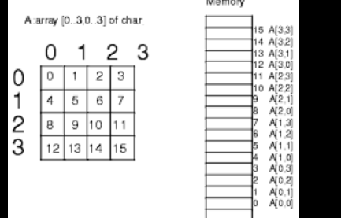

----
----

**Reverse traversal technique**
1. Replace all even numbers using same of two

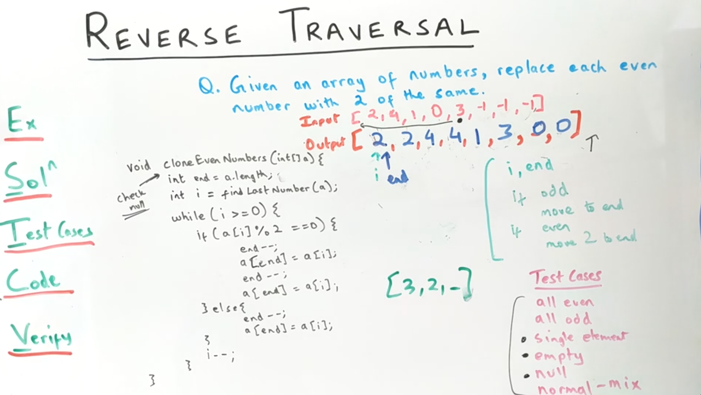

----
----

**Two pointer technique**
1. Reverse elements in array
2. Sorted array two sum problem
3. Sorted array non decreasing order, sqaures of each number non decreasing. 
4. Array fo integer, find a continuous subarray when sorterd makes entire array sorted

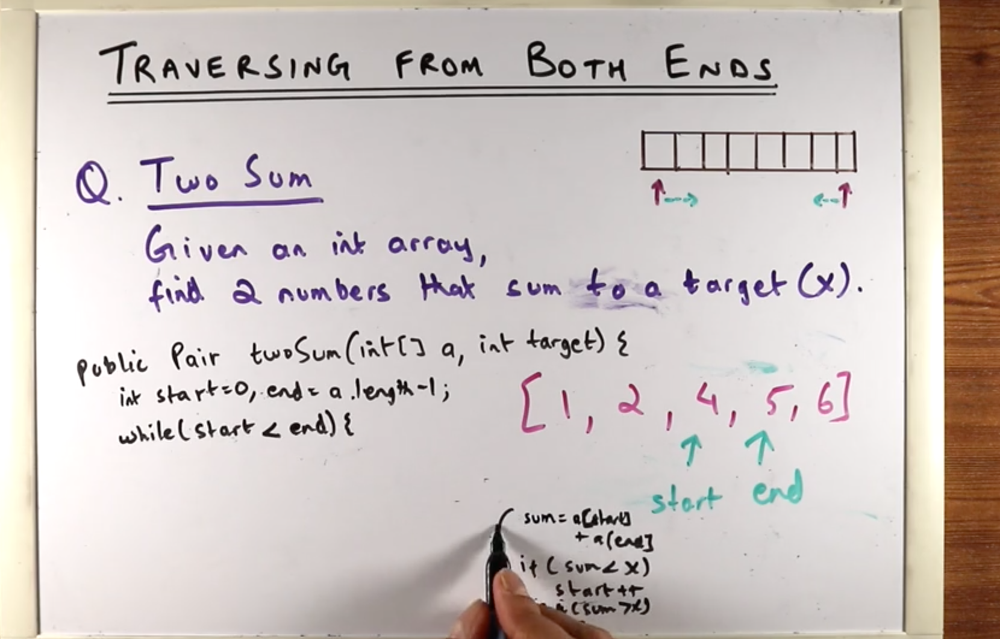
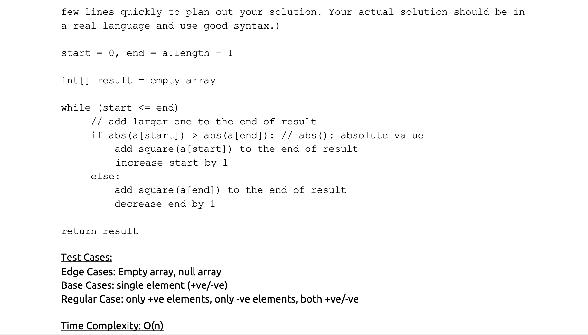

----
----
**Partitioning Arrays**
1. Dutch Flag problem
2. Move all zeros to front
3. Move all zeros to back
4. Three way partitioning (Dutch Flag Problem)

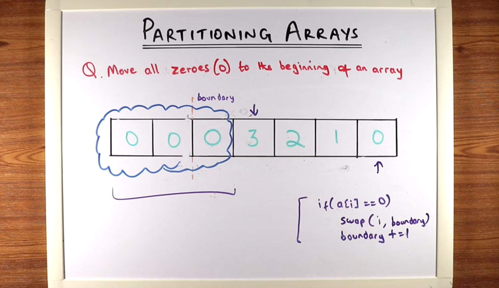

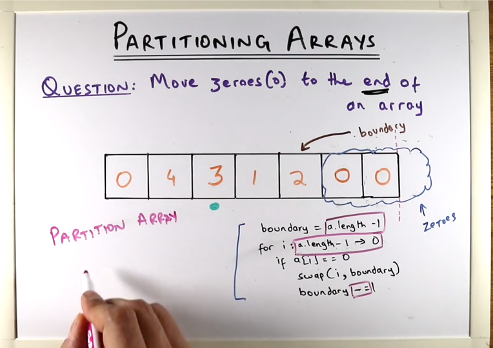

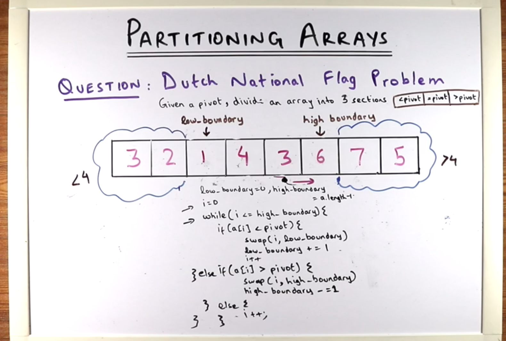

----
----
**Subarray Sum Problems**
- Understand the difference between subarray and subsets
- Subarray is always contiguous and subset is any elemants from the array

**Technique 1 (KADANE's algorithm)**
- Good to be used when it is contiguous

- *hint* : positive + negative number you can use KADANE's algorithm

1. Find the subarray with maximum sum 

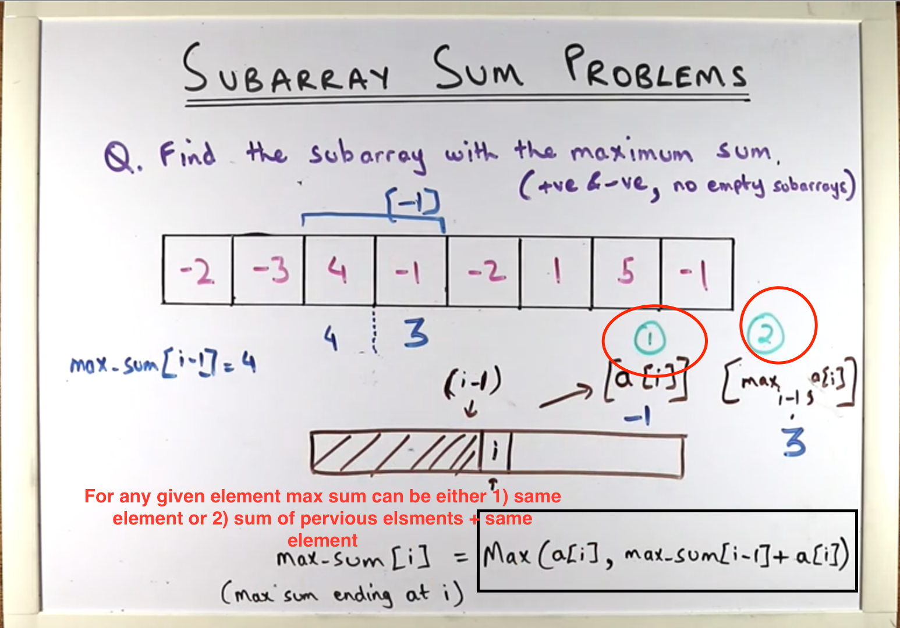
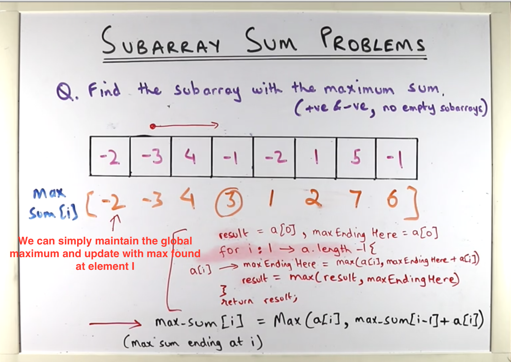

**Technique 2 Subarray Sliding window**
- Ask relavent question to array, +ve or -ve, sorted, null or empty, what result to return 
- sliding window only works on positive numbers otherwise you can't slide the window
- *hint* : see if all are positive number, sliding window might help, also unique charachter

1. subarray that sums to target

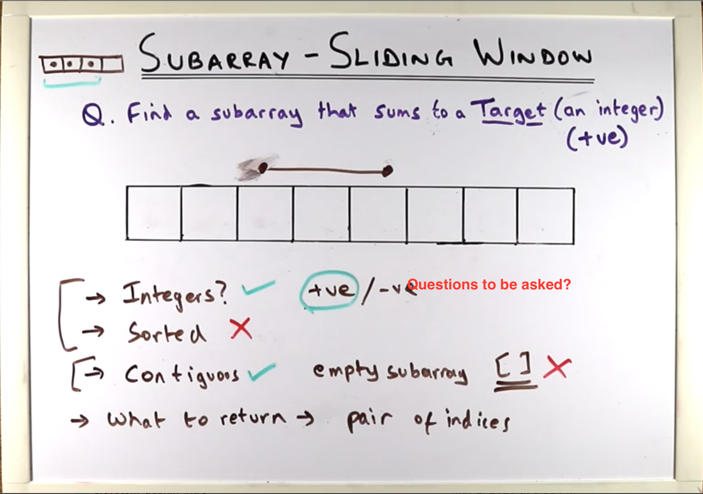
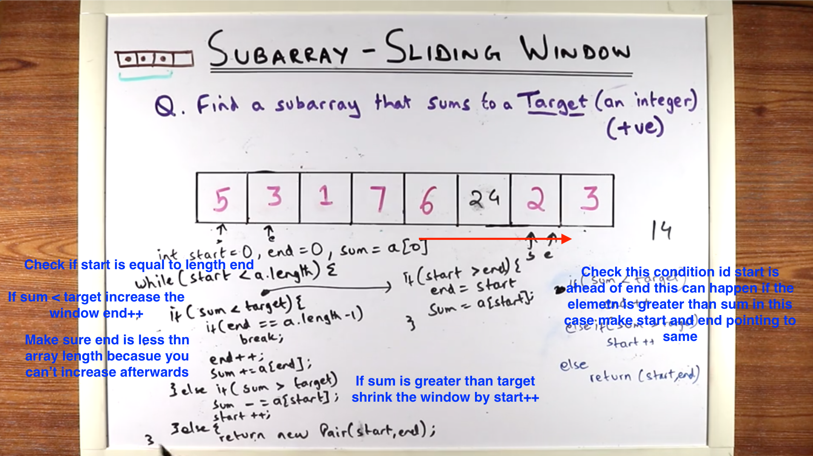

2. Find longest substring with unique charachters

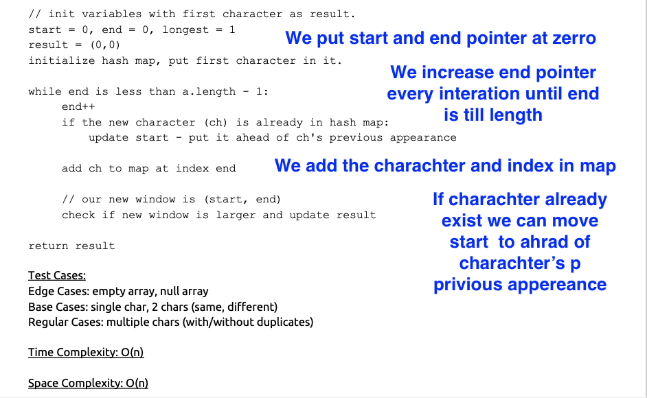

