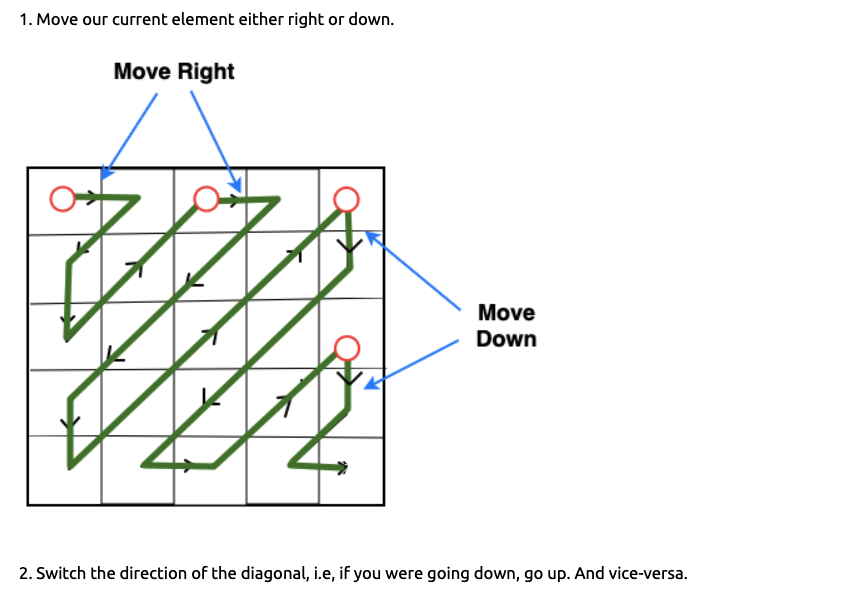

**Concepts**

1. Arrays provide O(1) lookup by index
2. They are of fixed size, you specify the size during creation in python `lst = [None] * 5`
3. Resizing an array is an expensive operation
4. 2D array representation in memory

----
----
**2D array representation in memory**

----
----

**Reverse traversal technique**
1. Replace all even numbers using same of two

----
----

**Two pointer technique**
1. Reverse elements in array
2. Sorted array two sum problem
3. Sorted array non decreasing order, sqaures of each number non decreasing. 
4. Array fo integer, find a continuous subarray when sorterd makes entire array sorted

----
----
**Partitioning Arrays**
1. Dutch Flag problem
2. Move all zeros to front
3. Move all zeros to back
4. Three way partitioning (Dutch Flag Problem)

----
----
**Subarray Sum Problems**
- Understand the difference between subarray and subsets
- Subarray is always contiguous and subset is any elemants from the array

**Technique 1 (KADANE's algorithm)**
- Good to be used when it is contiguous

- *hint* : positive + negative number you can use KADANE's algorithm

1. Find the subarray with maximum sum 

**Technique 2 Subarray Sliding window**
- Ask relavent question to array, +ve or -ve, sorted, null or empty, what result to return 
- sliding window only works on positive numbers otherwise you can't slide the window
- *hint* : see if all are positive number, sliding window might help, also unique charachter

1. subarray that sums to target

----

2. Find longest substring with unique charachters

**Technique 3 Prefix sum**

- Ask relavent question, like what is return type and what if there are multiple results
- This has two properties, which can be utilized to find array with sum = X
- can be postive and negative both
- Kadane's can be used when there is single result

1. Find subarray which sums to zero

- if only one result KADANE will help as well, but there are two properties so you can missout on other one

----

2. Find subarray which sums to X

**Technique 4 MAX DIFF**

- The Max Diff is the maximum difference between two elements in an array, with the lesser element coming before the greater element.

**2D Arrays**

- Rotate array by 90 degrees

- Print array in zigzag order 

https://www.filepicker.io/api/file/jmoYEixvTmjury2XKtlB

- Print array in spiral order

https://www.filepicker.io/api/file/jmoYEixvTmjury2XKtlB

**SPECIAL TRICKS**

- *Check if a string is trotation of another string*
- kaushal , shalkau is rotation of kaushal so simplay append these two and see if it substring.

- *reverse words in the string*
-  1) first reverse the entire string and 2) thn reverse the individual words (this will do it in place)

- *Longest palindrome in the string*
- abkayakcd --> longest palindrom is kayak. 
- You need to expand throgh bith the elemnts and the middle of each letter (and keep track of longest) start form the middle

**BIG INTEGER ADDITION**

- 100 digit number will not fit in normal int
- simple technique of using carry result%10 and use it

