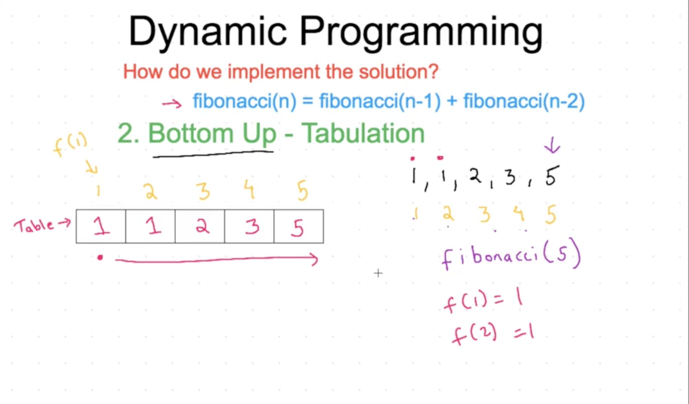

**DP**

- in oreder to be D Pproblems it should satisfay two condistions 1) re use the sub problems  2) sub problems
- DP problems can be solveed using 1) Top Down approach (recursion + memoization) 2) Bottom up approach (tabulation)

- climbing staircase using two approaches

**DP PROPOGATE ARRAY**

- coin change problem

- longest increasing subsequence

