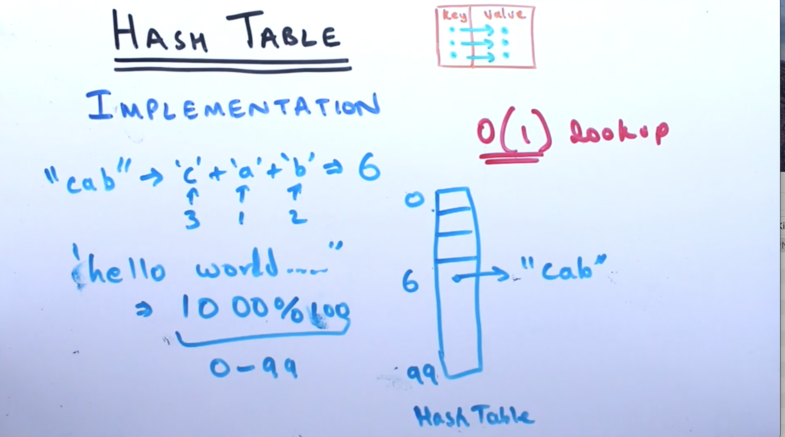
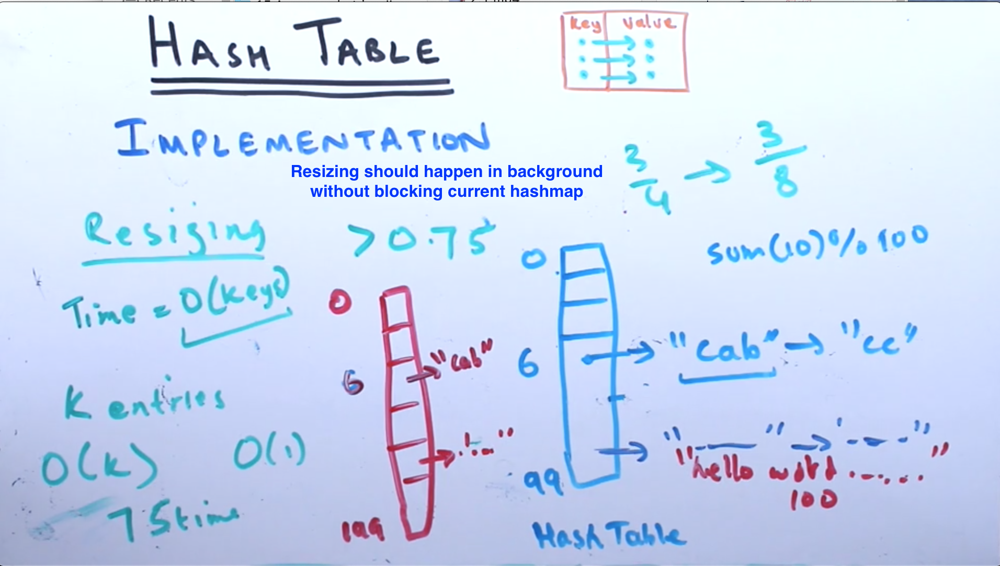
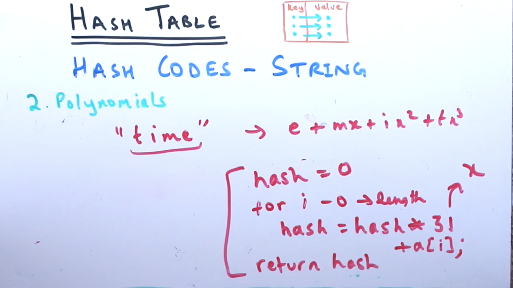
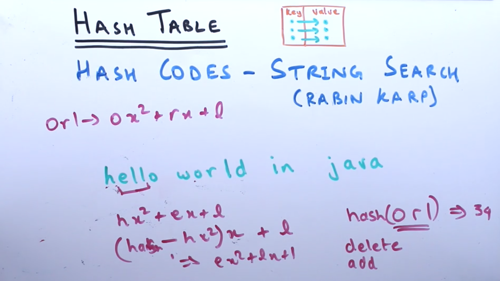

**HASHTABLE**

- chaining when the collision happens using linkedlist
- Loadfactor: calculated by (numberofelemnts in the hash map / actual size of hashmap)
- the best number for load factor is 0.75 when that happens you mostly resize
- when you resize you need to rmap all the old entries with new hadh function to
- simplest hash function sum(first 10 charachters mapped to siume number % number of elements)
- There are 2 ways to handle collisions: Linear Probing and Chaining. Chaining is more commonly used.

*Difference between hashmap and hashtable*
- There are several differences between HashMap and Hashtable in Java:
- Hashtable is synchronized, whereas HashMap is not. This makes HashMap better for non-threaded applications, as unsynchronized Objects typically perform better than synchronized ones.
- Hashtable does not allow null keys or values. HashMap allows one null key and any number of null values.

- One of HashMap's subclasses is LinkedHashMap, so in the event that you'd want predictable iteration order (which is insertion order by default), you could easily swap out the HashMap for a LinkedHashMap. This wouldn't be as easy if you were using Hashtable.

- Since synchronization is not an issue for you, I'd recommend HashMap. If synchronization becomes an issue, you may also look at ConcurrentHashMap.

**Hahscode genearation**

1. requirement is same string should always return the same string
2. It should be evenly distributed
3. It should use all values of inputs (in previous example we only considered first few charachters)

- Simple hash function is just count the charachter

- Using polynomials to calculate hash (e + mx + ix^2 + tx^2) (time)
1. To generate hash codes, we use polynomials. We set x to a prime number, e.g, 31, 53 or 101.
2. hash("boat") -> 'b'.x^3 + 'o'.x^2 + 'a'.x + 't'

**Hashcode for string search (RABIN CARP)**

- Using the same hashcode but we should be able to add or delete the elemnt so we can slide the window 
- for example, we have hello, you caclculate hash for hel =  hx^2 + ex + l  now to remove one (h) and add one (l) somply multiply x(ex + l) and + l

