**LINKED LIST**

- Given a Linked List L, separate it into 2 Linked Lists. One contains L's odd nodes and the other contains L's even nodes

input: Head -> 1 -> 2 -> 3 -> 4 -> 5
Result 1: Head -> 1 -> 3 -> 5
Result 2: Head -> 2 -> 4

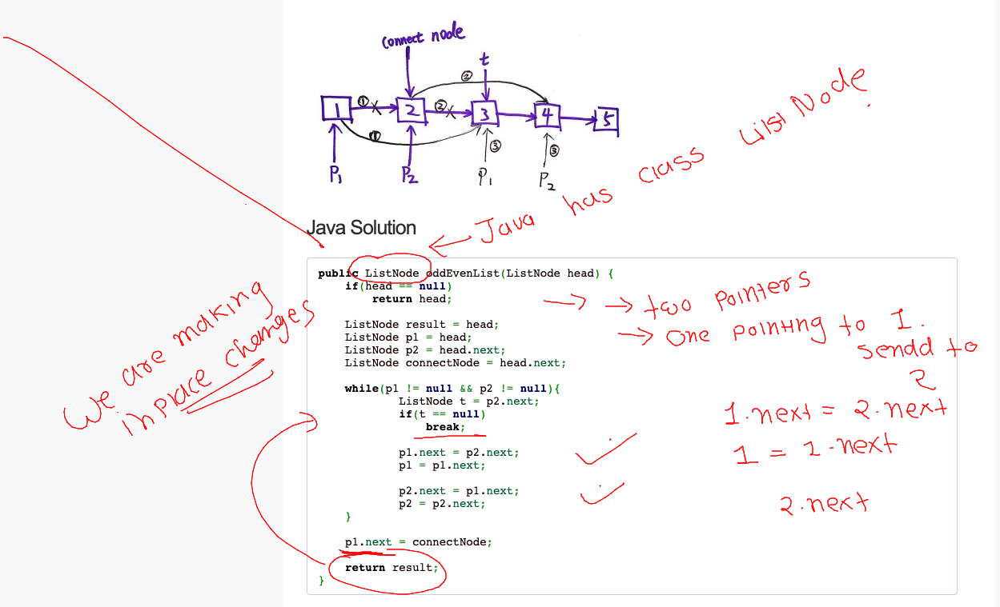

- Delete a node from the list given the previous node

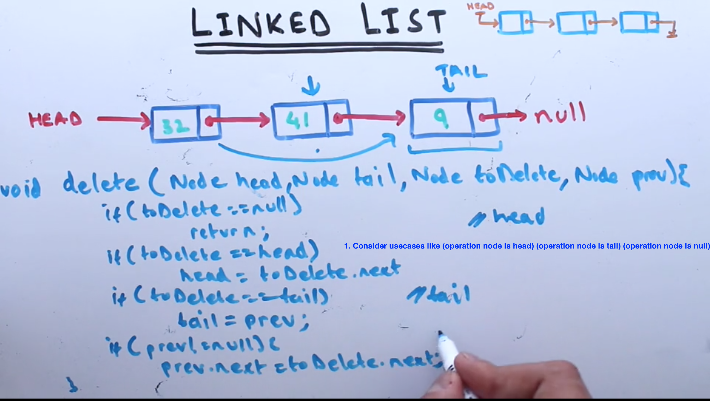
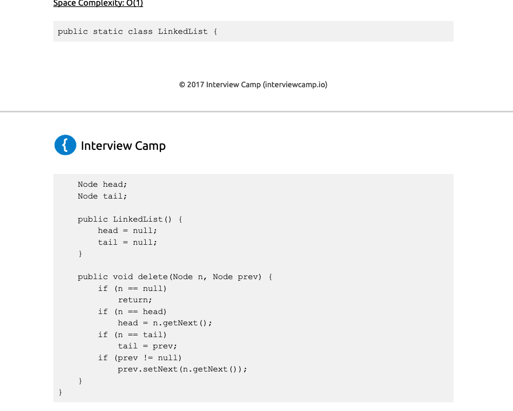

- Delete a node from the list when previous node is not given

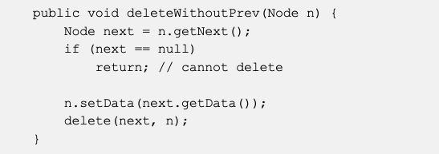

**LiNKED LIST SLOW AND FAST POINTER**

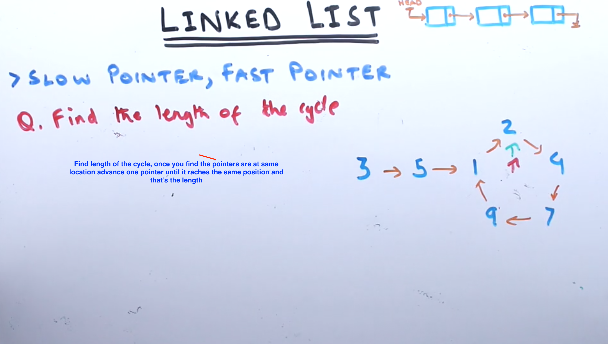
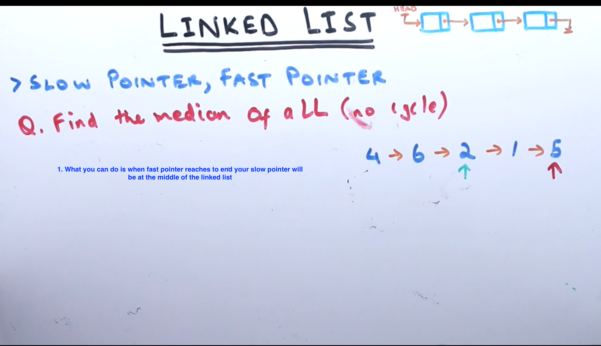
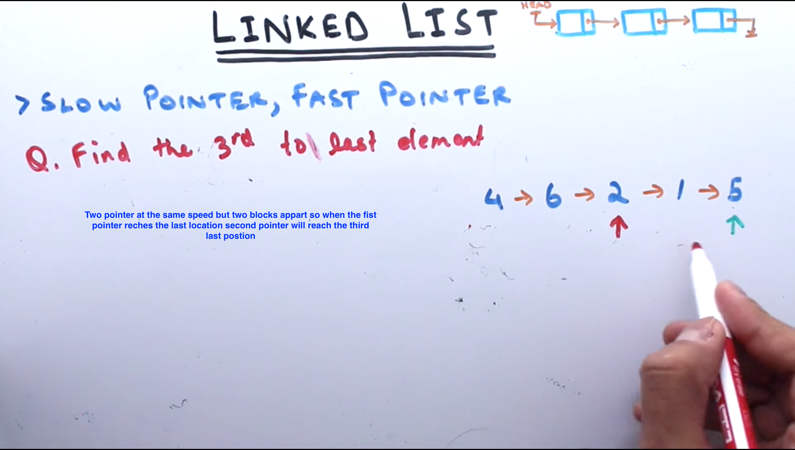
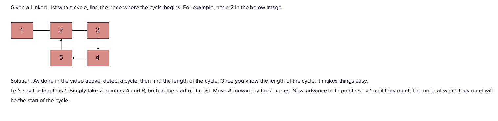

**LINKED LIST HASHTABLE**

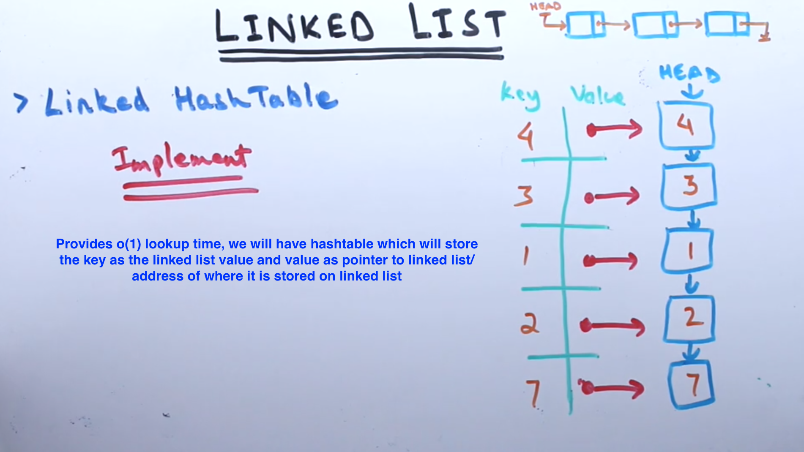

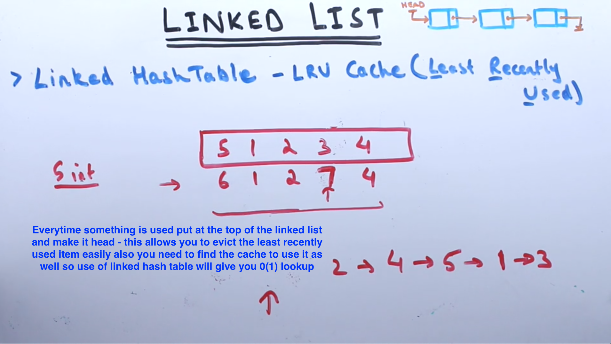

- implement the data structure for least recently used cache

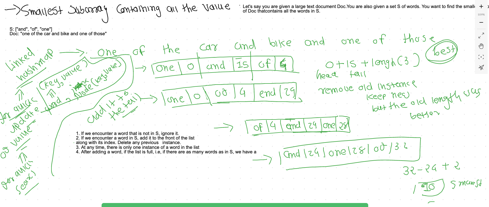

- reverse a linked list

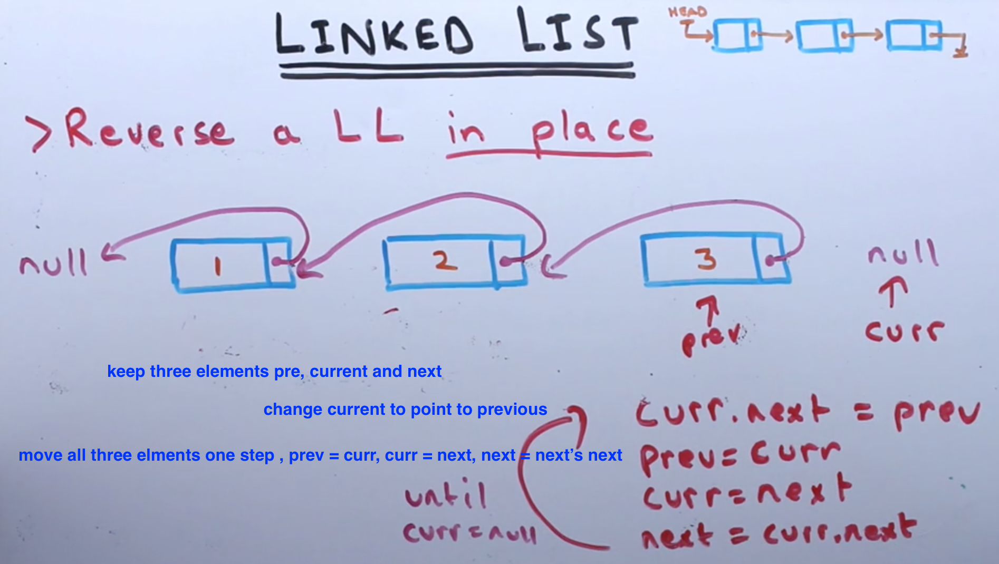
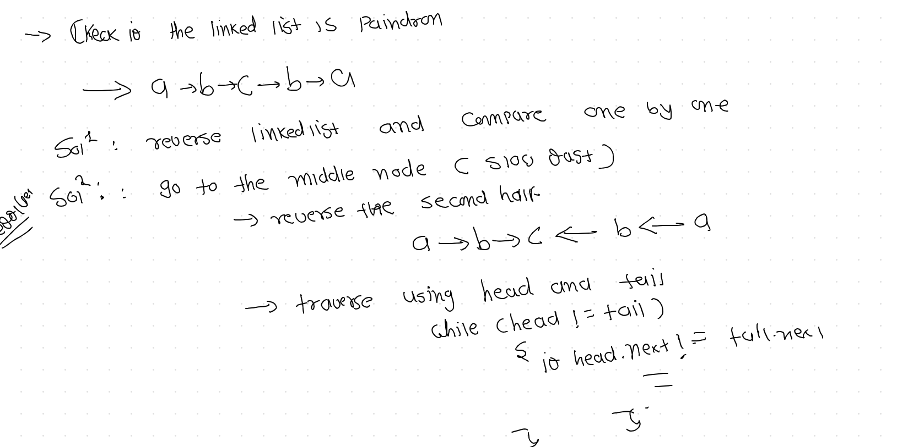