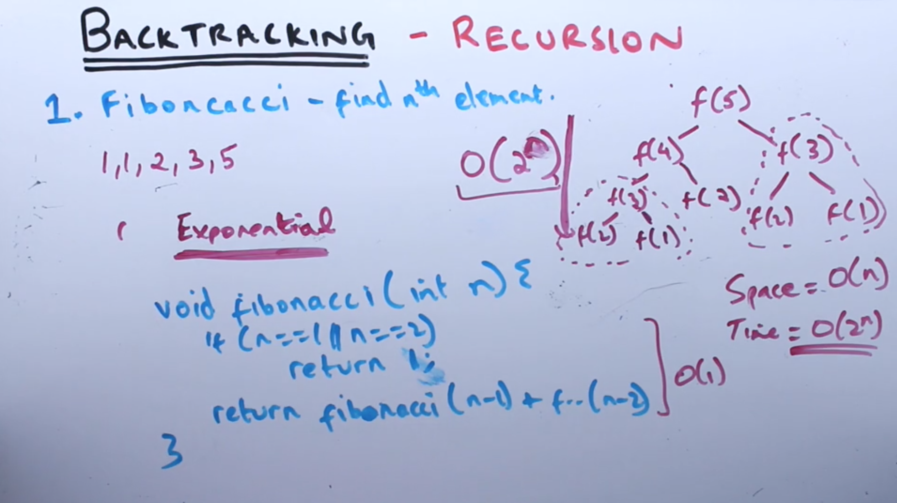
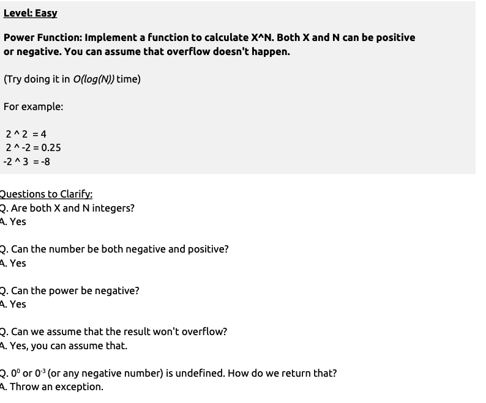
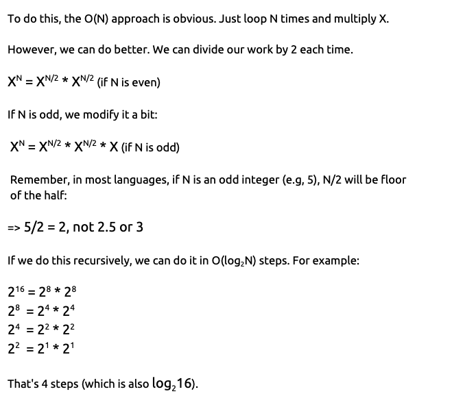
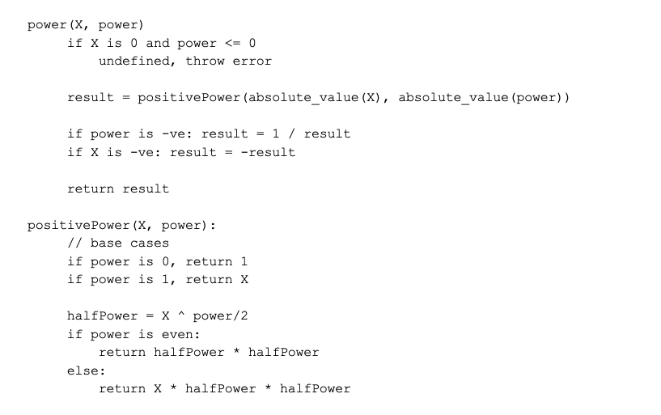
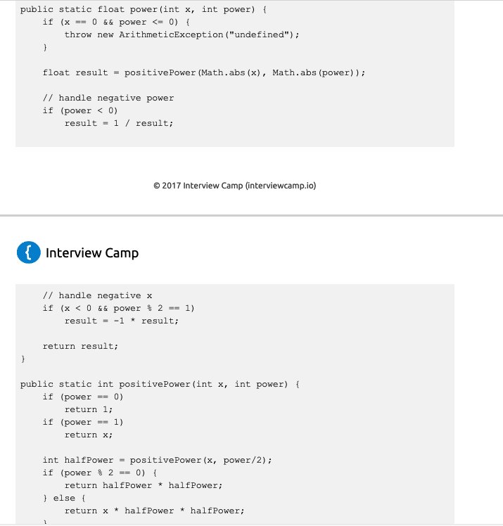
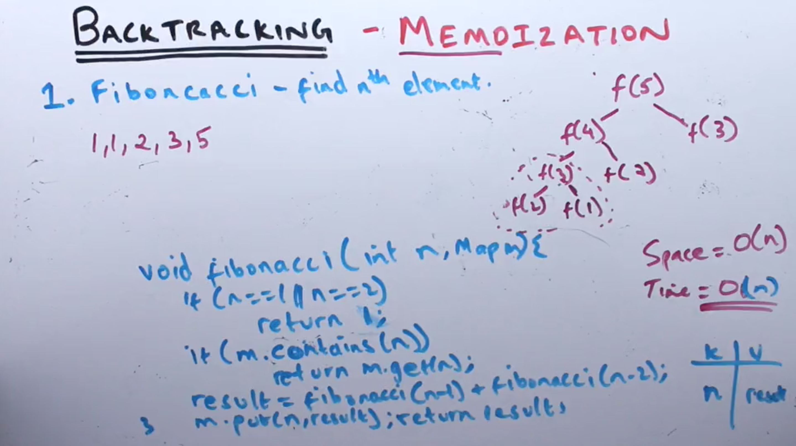
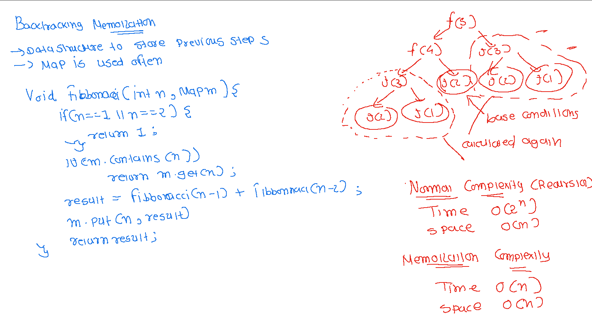

**BACKTRACKING TECHNIQUES**
- All recursive functions should have the following: 
1. Base Case, 
2. Working towards a base case,  (recursive step should take you closer to base case)
3. Recursive step.
- For each function call, recursion uses space on the program’s stack memory. So, be aware of space complexity. It is easy to assume that recursion takes O(1) memory. In reality, it might be taking more on the function stack.

- o(logN) so if the numbers are 16 you should be able to complate task in 4 steps squarroot(16) = 4 `O(log 16)`

**RECURSION**

**MEMOIZATION**

