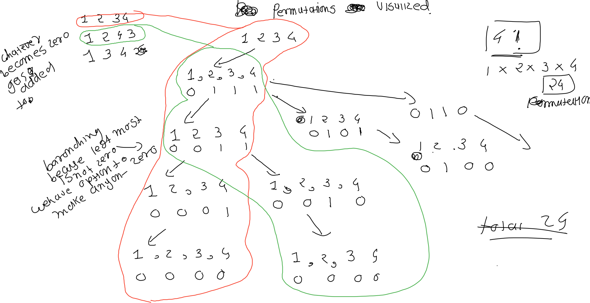
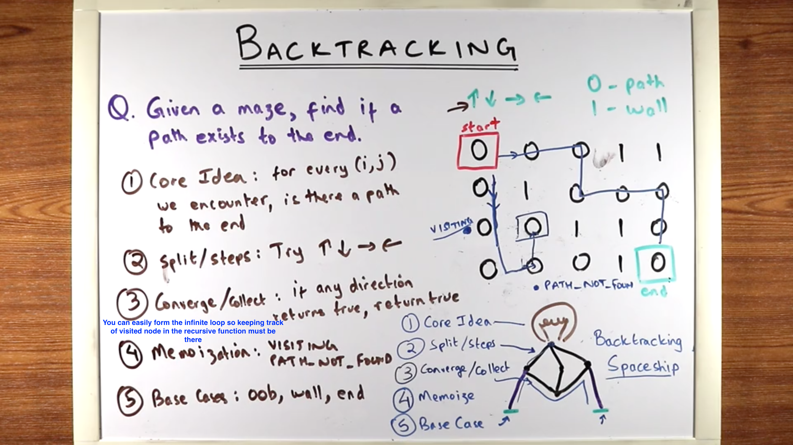
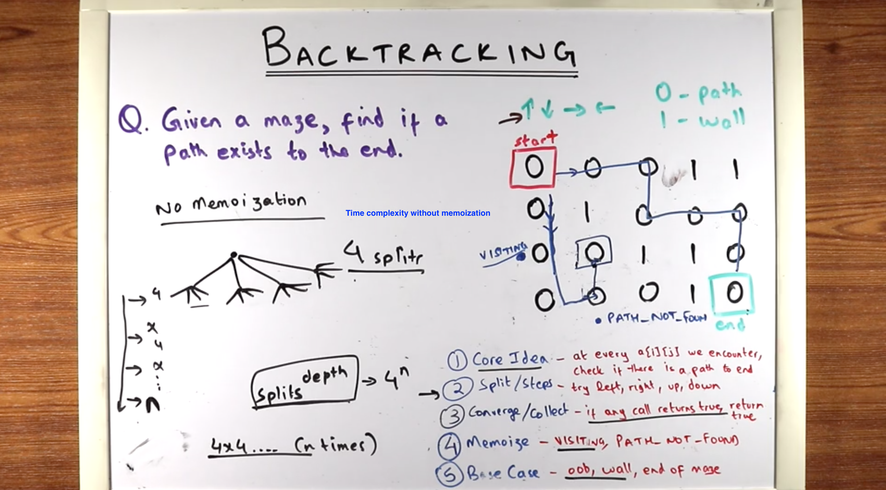
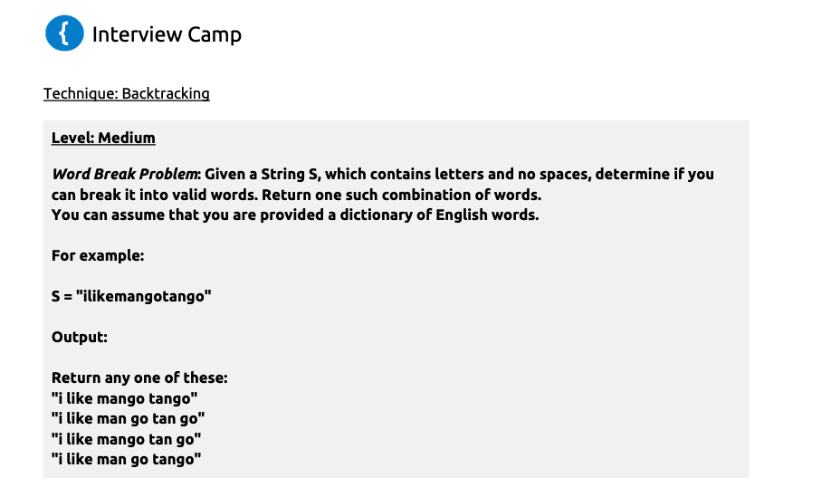
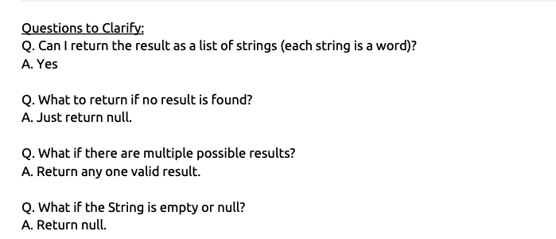
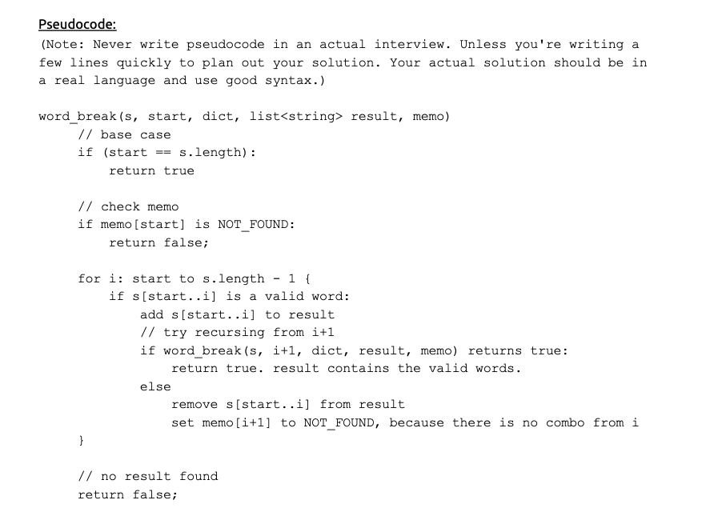
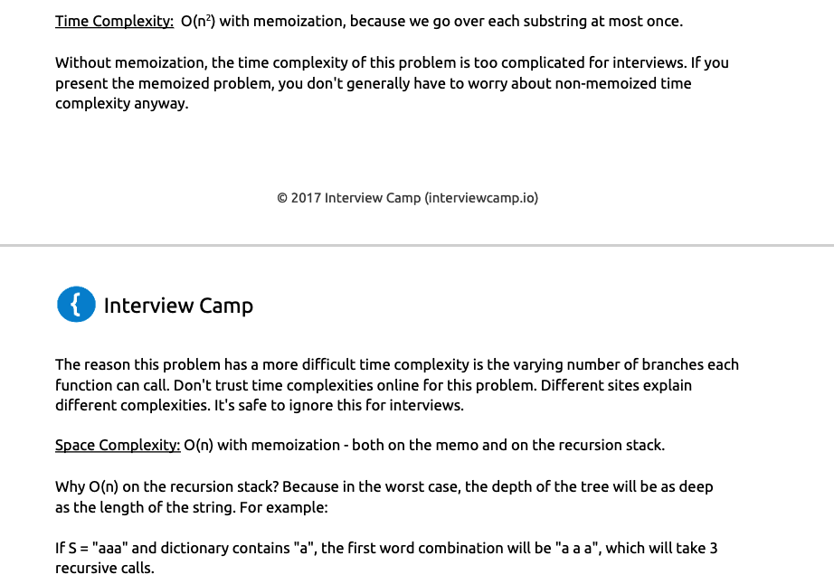

**BACKTRACKING TECHNIQUES**
- All recursive functions should have the following: 
1. Base Case, 
2. Working towards a base case,  (recursive step should take you closer to base case)
3. Recursive step.
- For each function call, recursion uses space on the program’s stack memory. So, be aware of space complexity. It is easy to assume that recursion takes O(1) memory. In reality, it might be taking more on the function stack.

- o(logN) so if the numbers are 16 you should be able to complate task in 4 steps squarroot(16) = 4 `O(log 16)`

**RECURSION**

------
------------------------------------------------

**MEMOIZATION**

-------------
------------------------

**AUXILLARY BUFFER RECURSION**
- Buffer is a good way to implement *TOP-DOWN* recusrsion.
- Problems requiring permutation and combination can be solved using this technique
- 4 step technique

1. Termination Cases
2. Find Candidates that go into the buffer
3. Place each candidate into the buffer
4. Recurse to next buffer index

----------------------------------------------------------------
1. Given an array, print all Combinations (or Permutations) of length X, Print all combinations of length 3.
`Q`. Can the array have duplicates?
`A`. No, you can assume there are no duplicate numbers.
`Q`. What to print if X is greater than the size of the array?
`A`. Print nothing, as there will be no valid combinations.
`Q`. What to print if the array is empty?
`A`. Print nothing as there will be no combinations

*Time Complexity: Factorial Complexity* O(n!)
`we know that there are ​n​C​r​ possible combinations, which is in factorials.We need that many leaves of the recursion tree.`
*Space Complexity: O(X)*
----------------------------------------------------------------
2. Print all permutations of length X.

Q. Can we assume there are no duplicates?
A. Yes
Q. If the input is an empty array, do we just print nothing?
A. Yes
Q. If the input is null, should we throw an exception of simply print nothing?
A. Let's just print nothing.

*Time Complexity: Factorial Complexity* 
Note:​ Typically, interviewers will not ask the time complexity of such complex recursions.The first level of the recursion tree has ​n​ function calls. At the second level, each function call spawns n-1​ more calls. 
The total number of calls looks as follows:n * (n - 1) * (n - 2) * (n - 3) * ... * (n-X)
This is factorial time - you can also write it as ​n!/(n-X-1)!
Space Complexity:​ O(N), where N is A.length. We use O(N) space both in the buffer allocation

----------------------------------------------------------------
3. Print all Subsets of an array. Print all subsets of an array of integers.

Q. Do we print out the empty set?
A. Yes
Q. Can we assume there are no duplicates?
A. Yes
Q. If the input is an empty array, do we just print out the empty set?
A. Yes
Q. If the input is null, should we throw an exception of simply print nothing?
A. Let's just print nothing.

----------------------------------------------------------------
4. Phone Number Mnemonics Problem Given an N digit phone number, print all the strings that can be made from that phone number. Since 1 and 0 don't correspond to any characters, ignore them. For example:
213 => AD, AE, AF, BD, BE, BF, CD, CE, CF 
456 => GJM, GJN, GJO, GKM, GKN, GKO,.. etc.
`Q`. Is the phone number of a specific size?
`A`. No, it can be of any size
`Q`. Can we assume that the input will have only digits?
`A`. Yes
`Q`. Does the string have to be a valid English word?
`A`. No, the string can be anything.
`Q`. How do we handle if phone number is empty or null?
`A`. Print nothing.

*Time Complexity:​ Exponential Complexity* - O(4​^n​), where ​n​ is the size of the phone number.At each function call, we can call at most 4 function calls. We do this at most N times, so the totalnumber of function calls is:4 X 4 X 4 .. (n times), which is 4​^n
*Space Complexity:​ O(n)*, where ​n​ is the size of the phone number. The O(n) space is takenboth by the buffer and the call stack.

----------------------------------------------------------------
5. Ccoin change problem - Given a set of coin denominations, print out the different ways you can make a target amount. You can use as many coins of each denomination as you like.

Q. Does [1,2] and [2,1] count as one, i.e, do we care about permutations?
A. No, we only care about combinations, so [1,2] and [2,1] will count as the same.

Q. Can we assume that all coins will be integers greater than 0?
A. Yes

<object data="https://www.filepicker.io/api/file/ksVsqH9rQpG1PwBQbjng" type="application/pdf" width="700px" height="700px">
    <embed src="https://www.filepicker.io/api/file/ksVsqH9rQpG1PwBQbjng">
        
This browser does not support PDFs. Please download the PDF to view it: <a href="https://www.filepicker.io/api/file/ksVsqH9rQpG1PwBQbjng">Download PDF</a>.

    </embed>
</object>

https://www.youtube.com/watch?v=nYFd7VHKyWQ

----------------------------------------------------------------
----------------------------------------------------------------

**BACKTRACKING**

Core Idea
1. From every ​a[i][j]​, check if there is a path to theend.
2. Steps/Splits:  Check from left element, right element, up and down.
3. Converge/Collect If any of the checks returns ​true​, return ​true​.
4. MemoizationCan we memoize? Yes, for every element, we cansave three states: ​UNVISITED​, ​VISITING​, NO_PATH_FOUND​.
5. Base Cases: a[i][j]​ is Out of Bounds, Wall,or the  last element

- Maze Problem: You are given a 2D array that represents a maze. It can have 2 values - 0 and 1. 1 represents a wall and 0 represents a path. The objective of the maze is to reach the bottom right corner, or A[A.length-1][A.length-1]. You start from A[0][0] and can only go in 4 directions - up, down, left or right. Find if a path exists.

Q. How do you want the output?
A. Return ​true​  if a path exists.
Q. Does it matter if the end is a path or a wall?
A. It doesn't matter, the last element (​A[A.length-1][A.length-1]​) can be anything. You just have to getthere.
Q. What if the array is empty or null?
A. Return ​false​ (no path exists).
Q. What if the array has just one element, e.g, ​{0}​ or ​{1}​.
A. Return ​true​, because we're already at the last element.

- Similar Problems 

1. Word break problem

2. Sudoku solver
2. n-queens problem

<object data="https://www.filepicker.io/api/file/kturPJRISaqQ3SM4ckut" type="application/pdf" width="700px" height="700px">
    <embed src="https://www.filepicker.io/api/file/kturPJRISaqQ3SM4ckut">
        
This browser does not support PDFs. Please download the PDF to view it: <a href="https://www.filepicker.io/api/file/kturPJRISaqQ3SM4ckut">Download PDF</a>.

    </embed>
</object>