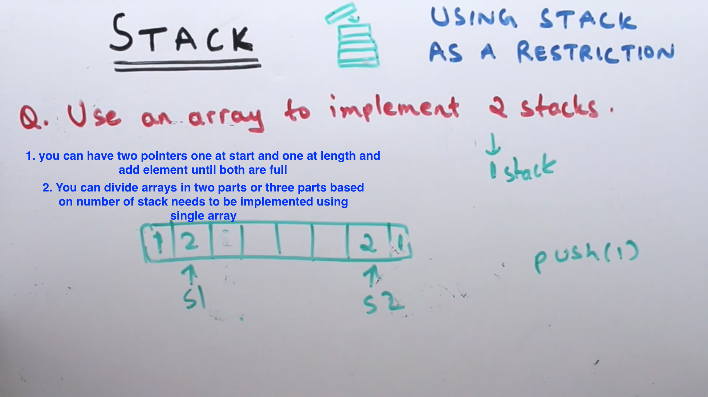

**STACK**

- travrse a stack, use temp stack. 

- implement queue using two stack. Easy use one to push and use one to pop and if there is no element in pop stach add all element from push stack

- implement two/three stack using one array

- Implement stack with O(1) lookup of the maximum element in the stack.png "Title"
  
  - this one if you just maintain the max element thn you can keep track of max in variable.
  - you can also have stack datastructure modifiewd where you keep the value and max at that point e.g. [(3,3), (2,3), (1,3), (3,3) ] O(n)
  
  - or you use the other stack where you keep the max value 
  

- Stack postfix evaluation. simple as soon as you see operator pop two elements from stack and evaluate

- Stack infix evaluation. Here operator precedence rule will be applied. So if your operator is higher in operator stack than next coming elemtnt start processing until all operators are greater or equal to coming operator e.g [/ , +, -] is there and + is coming thn as / is higher precedence and + and - is equal so start processing all by popipn all on by one.

- Process infix with brackets, same as above just put the opening bracket in operand stack and whenever is closig bracket found process all element from operand stack until opening bracket is found  

