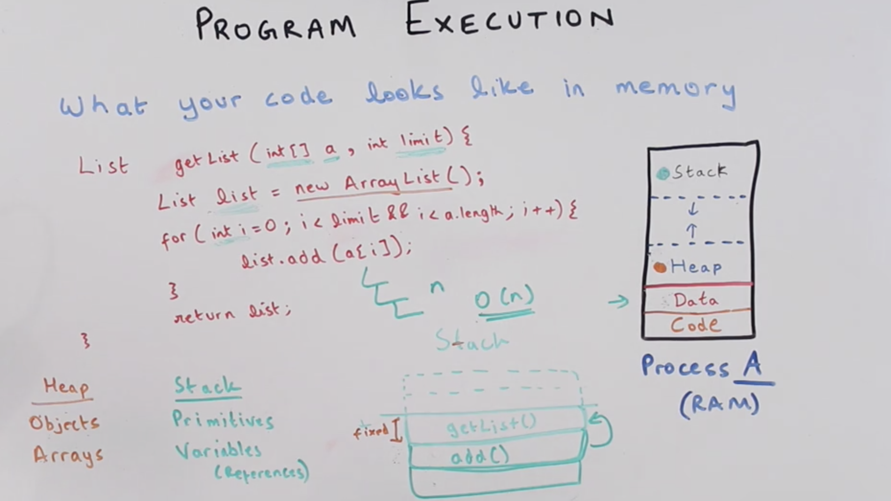

**Type of Memory**
- RAM and Disk
- Lookup time is 100 times slower in disk

**Program execution**
- When process start it contains CODE, DATA, STACK and HEAP memory
- *Code* - contains instructions
- *Data* - Global and static variables
- *Stack* - Function calls (Every time you call a function it creates stack frame for that) (stack overflow)
- *Heap* - Allocating object on the fly, if you are not sure how much memory it's going t0 take, for example `new Object()` (heap overflow)
- Arrays and objects or DS stores on *Heap* but references to those objects, Primitives and variables are stored in *Stack* 
- Recursive algorithm that calls a function N times for an input of size N will have O(N) complexity

